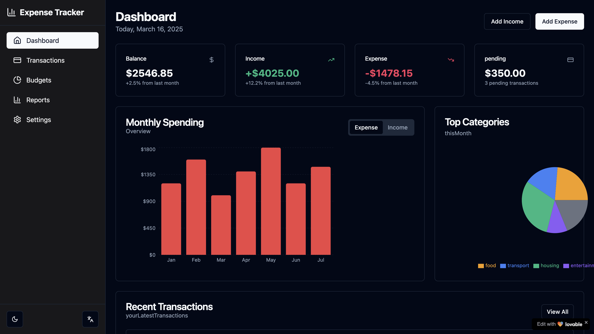

# 💰 Expense Tracker



🚀 **Live Demo:** [Expense Tracker](https://basit-dev-de.github.io/expense-tracker/)

## 📌 Overview
The **Expense Tracker** is a user-friendly web application that helps you **track your income and expenses** efficiently. It provides real-time balance updates and detailed transaction history, making personal finance management easy and transparent.

## ✨ Features
- ✅ **Add Income & Expenses** – Easily log transactions with descriptions and amounts.
- 📊 **Real-time Balance Calculation** – Automatically updates your total balance.
- 📜 **Transaction History** – View a list of all transactions with delete options.
- 🎨 **Responsive UI** – Works seamlessly on all devices (Mobile, Tablet, Desktop).
- 🚀 **Built with React & TypeScript** – Ensuring a modern and maintainable codebase.
- 🔥 **LocalStorage Integration** – Transactions persist even after refreshing the page.

## 🛠 Tech Stack


## 📦 Installation & Setup
Clone the repository and install dependencies:
```sh
git clone https://github.com/basit-dev-de/expense-tracker.git
cd expense-tracker
npm install
```

### 🚀 Run the Application
```sh
npm run dev
```

## 🤝 Contribution
Contributions are welcome! Feel free to fork the repo and submit a pull request.

## 📬 Connect with Me
- **GitHub:** [basit-dev-de](https://github.com/basit-dev-de)
- **Portfolio:** [Website](https://basit-dev.com)
- **Email:** [basit.ali@toptal.com](mailto:basit.ali@toptal.com)

🚀 **Manage your expenses smarter with this simple tracker!**

